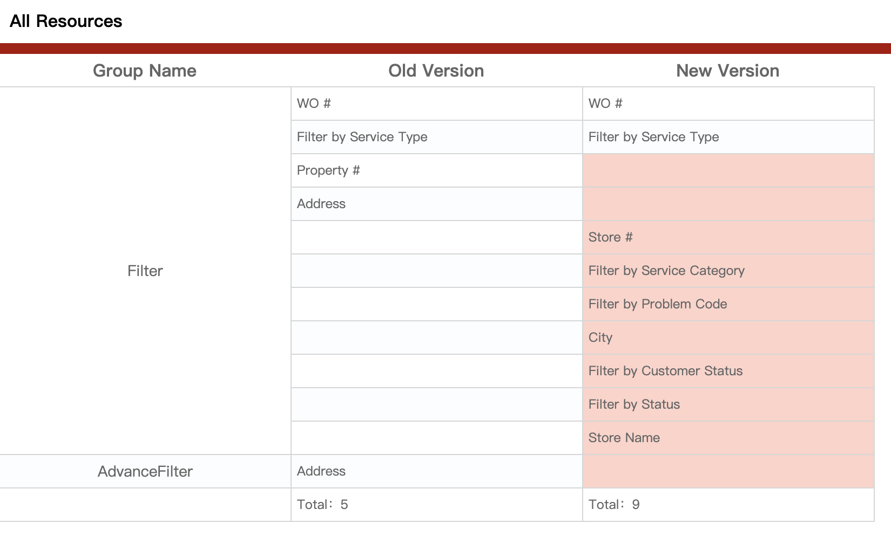
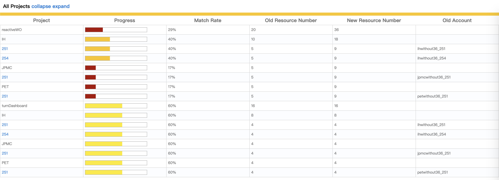

# 前端自动化解决QA重构对比测试难题

嗯，周末在家抱着沉睡中的宝宝边翻掘金，翻到一篇介绍`puppeteer`的文章，联想到最近正在搞的Client端重构，终觉能做点什么……

因为这次大规模的重构全面使用了资源权限替代老版本中的硬编码鉴权，而这些入库的资源整理全部来自于对老代码的人为判断（得益于之前的Hive架构，每个模块重构都是独立负责人，由其收集资源再合适不过了）。

但人眼总归不太可信，QA需要针对30+客户，平均8个左右的角色，首期20个重构功能用肉眼进行新老界面资源比较测试。粗略计算下时间：按每个功能5分钟的比较时间计算，
```
30（客户）* 8（角色）* 2（新老2个账号）* 20（功能）* 5（分钟）=  48000 （分钟）
```
也就是`800`小时，不吃不喝不睡`33`天/人。

然后思维开始跳脱，遐想，我应该能用`puppeteer`为QA小姐姐们做点什么才是。

## Puppeteer是什么？
>Puppeteer 是一个 Node 库，它提供了一个高级 API 来通过 DevTools 协议控制 Chromium 或 Chrome。Puppeteer 默认以 headless 模式运行，但是可以通过修改配置文件运行“有头”模式。

也就是说，它是google为chrome量身打造的，而且还是nodejs实现的，想想就很激动对不对？

## Puppeteer能做什么？
>你可以在浏览器中手动执行的绝大多数操作都可以使用 Puppeteer 来完成！ 下面是一些示例：
>
>生成页面 PDF。
>
>抓取 SPA（单页应用）并生成预渲染内容（即“SSR”（服务器端渲染））。
>
>自动提交表单，进行 UI 测试，键盘输入等。
>
>创建一个时时更新的自动化测试环境。 使用最新的 JavaScript 和浏览器功能直接在最新版本的Chrome中执行测试。
>
>捕获网站的 timeline trace，用来帮助分析性能问题。
>
>测试浏览器扩展。

## 我的设想
基于Hive的子项目管理功能，封装一个类似于分布式的自动化测试框架。

- 首要目的是解决资源比对的问题； 
- 框架能自动帮每一个子项目登录新老账号，并自动导航到子项目页面；
- 分发下去，由子项目的负责人实现自己的资源采集与截屏操作；
- 管理每个`功能-客户-角色`的对应资源数据；
- 在`功能-客户-角色`的对应位置生成测试报表与截屏，特别是报表，包含了新老功能的资源比对，匹配不上的会**标红**，还会计算**匹配百分比**；
- 提供一些API给子项目使用，譬如：
  - 屏幕截取，puppeteer提供的原生截屏api需要手动指定生成位置，我提供的已经预置好生成位置，并极大的简化了api，比如`api.screenshot(name)`即可生成一张名为`name_new`或`name_old`的截屏文件到相应位置；
  - 添加资源，当操作权交由子项目接管时，他们能使用puppeteer在页面上抓取指定的资源元素，调用添加资源的api将其添加，最终生成新老资源比对报表；
  - 其它一些简化过的api等。
- 类似于分布式系统一样，框架会去挨个调用各个子项目的实现，最终生成详细报表与大纲报表


## Puppeteer 安装指南

> Puppeteer需要node版本v7.6.0以上才支持async/await，建议安装最新stable版本。

安装Puppeteer时会自动下载最新的Chromium(~71Mb Mac, ~90Mb Linux, ~110Mb Win)，这一步对于国内的网络而言是非常不友好的。

可以在安装前执行以下命令避免自动下载Chromium：
```
npm config set puppeteer_skip_chromium_download true
```

安装puppeteer与typescript支持。
```
npm install puppeteer @types/puppeteer --save-dev
```
使用方法
```javascript
  const browser = await puppeteer.launch({
    executablePath: 'C:\\Program Files (x86)\\Google\\Chrome\\Application\\chrome.exe',
    headless: false, // 无头模式
    timeout: 0, // 超时时间
    // devtools: true, // 自动打开devtools面板
    defaultViewport: defaultViewport, // 默认窗口尺寸
    args: ['--start-maximized'], // 浏览器默认参数 [全屏]
  });
```

对于忽略了Chromium内核下载的情况，需要加上`executablePath`这个属性，手动指定本地的chrome执行文件位置。

`headless`属性默认为true，代表是否启动无头模式（不使用浏览器界面直接进行测试）

## 然后我们来了解一下Puppeteer的API

有了上面launch的浏览器实例之后，创建一个新页签：
```javascript
  const page = browser.newPage();
```

多数时候我们都是在跟page对象打交道，比如：

前往某页面
```javascript
  await page.goto(`${context}/Account/Login`, {
    waitUntil: "networkidle0"
  });
```
第二个是可选参数，拿`waitUntil`举例，意思是await直到没有任何网络请求时才继续执行之后的代码。

它有四个可选值，分别如下：

- load - 页面的load事件触发时
- domcontentloaded - 页面的DOMContentLoaded事件触发时
- networkidle0 - 不再有网络连接时触发（至少500毫秒后）
- networkidle2 - 只有2个网络连接时触发（至少500毫秒后）


在登录页，我们需要操作表单，输入一些内容
```javascript
  await page.type('#userName', account.username);
  await page.type('#password', account.password);
  await page.click('button[type=submit]');
```
`type`方法意味着键入，第一个参数是元素选择器（input元素），第二个参数是需要输入的内容

`click`方法代表触发某选择器指定元素的点击事件（除了click，还有hover、focus、press等事件）

>puppeteer有几个特点：
>
>1，所有的操作都是异步的，都需要使用`async`、`await`去调用。因为它是基于chrome DevTools协议的，与chrome的互相调用都是靠发送异步消息。
>
>2，大量的api依赖选择器，所以css选择器需要了解； 
>
>3，有一部分隐藏api没有在文档上体现出来，比如如何打开隐身模式，如何清除cookie等。

当完成表单输入与点击提交之后，我们需要跳转到子项目页面去，但是，在这之前我们需要等待登录操作完成才行
```javascript
  await page.waitForNavigation({
    waitUntil: "domcontentloaded"
  });
```
此处，我们看到`waitUntil`的第二个枚举值了`domcontentloaded`，它的意思是和document的`DOMContentLoaded`事件是一样的意思。了解前端开发的童鞋应该都清楚它与`onload`事件的差异，我这里就不多说了，反正比`onload`时间点靠前很多。

获取页面元素
```javascript
  const input = await page.$('input.form-input');
  const buttons = await page.$$('button');
```
`page.$` 可以理解为我们常用的 `document.querySelector`, 而 `page.$$` 则对应 `document.querySelectorAll`。

```javascript
  // 获取视窗信息
  const dimensions = await page.evaluate(() => {
      return {
          width: document.documentElement.clientWidth,
          height: document.documentElement.clientHeight,
          deviceScaleFactor: window.devicePixelRatio
      };
  });
  const value = await page.$eval('input[name=search]', input => input.value);
```
`page.evaluate` 意为在浏览器环境执行脚本，可传入第二个参数作为句柄，而 `page.$eval` 则针对选中的一个 DOM 元素执行操作。

#### 此外，还有一个功能很有意思`page.exposeFunction`暴露函数
```javascript
  const puppeteer = require('puppeteer');
  const crypto = require('crypto');
  
  puppeteer.launch().then(async browser => {
    const page = await browser.newPage();
    page.on('console', msg => console.log(msg.text));
    await page.exposeFunction('md5', text =>
      crypto.createHash('md5').update(text).digest('hex')
    );
    await page.evaluate(async () => {
      // use window.md5 to compute hashes
      const myString = 'PUPPETEER';
      const myHash = await window.md5(myString);
      console.log(`md5 of ${myString} is ${myHash}`);
    });
    await browser.close();
  });

```
上面的例子展示了如何暴露一个md5方法到window对象上

因为`nodejs`有很多工具包可以很轻松的实现很复杂的功能，比如要实现`md5`加密函数，这个用纯js去实现就不太方便了，而用nodejs却是几行代码的事情。

## 开始设计我们的框架

步骤贴出来

- 准备一份账号列表（包含新老版本），获取这个列表；
- 使用`lerna ls`获取所有的子项目列表，转而寻找其实现了的`xxxx/autotest/index.ts`文件；
- 循环账号，每个账号登录进去，再循环所有子项目，挨个导航进去，将操作权以及准备好的`page`与`api`对象交给子项目。
  - 子项目收集资源与截屏
- 结束操作，将收集到的所有资源分门别类的按`功能-客户-角色`位置生成新老对比报表
- 最后生成大纲报表

其实步骤非常简洁明了。

先贴一下最终的报表截图
#### 详情报表

#### 大纲报表


新老资源对比，有差异的地方都标红处理，并给出各自的资源总数与匹配百分比，类似于Jest单元测试生成的测试报告。

再贴一下主要实现代码
```javascript
  const doAutoTest = async (page: puppeteer.Page, resource: IAllProjectResource, account: IAccount, projectAutoTestList: IAutoTest[], newVersion: boolean) => {
    await login(page, account);
    const clientCode = await getCookie(page, 'ClientCode');
    const clientDevRole = await getCookie(page, 'ClientCurrentRole');
    for(const autotest of projectAutoTestList) {
      await page.goto(`${context}${autotest.url}`, {
        waitUntil: "domcontentloaded"
      });
      const api: IpuppeteerApi = {
        logger: logger,
        screenshot: screenshot({ page, newVersion, clientCode, clientDevRole, subProjectName: autotest.name }),
        addResource: addResource({ newVersion, clientCode, clientDevRole, subProjectName: autotest.name, projectResource: resource, username: account.username }),
        isExist: isExist({ page })
      };
      !newVersion ? await autotest.oldVersionTest(page, api) : await autotest.newVersionTest(page, api);
    }
  };

  (async () => {
    const browser = await launch();
    const projectAutoTestList = getSubProjectAutotests();
    const accounts = getAccounts();
    const resource = getResource();
    const page = await createPage();
    for(const accountGroup of accounts) {
      await doAutoTest(page, resource, accountGroup.oldVersionAccount, projectAutoTestList, false);
      await doAutoTest(page, resource, accountGroup.newVersionAccount, projectAutoTestList, true);
    }
    
    exportHtml(resource);
    await browser.close();
  })();
```

## 是否到这里就结束了？

No，作为一个不折腾会死的技术宅，我觉得还可以更进一步，做到极致！

目前我们的自动化测试是挨个账号登入，并挨个功能进行测试。当然，对于这个流程来说是没问题的，人类也是这样测试的，只是机器不用休息，“手速”更快而已……

但，

CPU跑满了吗？

内存跑满了吗？

机器发挥了应有的价值了吗？

是的，也许你也猜到了，**多任务**，**并发**

起初我会想，对于chrome而言，我们打开的浏览器是共享session的，随便看了看文档没发现有新建session相关的api……

那我们可以登单个账号，开多个页签同时测多个功能吧！

答案是可以的，但我仍然不死心，google了一圈，还真发现了一个隐藏api
```javascript
  const { browserContextId } = await browser._connection.send('Target.createBrowserContext');
  _page = await browser._createPageInContext(browserContextId);
  _page.browserContextId = browserContextId;
```
通过发送`Target.createBrowserContext`指令（暂且称之为指令吧），可以创建一个新的上下文（用浏览器的功能来说就是创建一个隐身模式）。然后通过`browser._createPageInContext(browserContextId)`就可以得到这个新的隐身模式窗口对象！

通过这个api，我可以创建无数多个session隔离的page对象！

有了这个api，我就可以实现`n*m`二维并发（并发多个账号登录，每个账号并发多个功能测试）

## 首先，我需要稍稍改造一下代码

大部分的代码不需要改动，把它们看待成`任务`即可，基本上需要添加的是任务调度逻辑。

实现一个TaskQueue队列
```javascript

export default class Task<T = any> {

  executor: () => Promise<T>;

  constructor(executor?: () => Promise<T>) {
    this.executor = executor;
  }

  async execute() {
    return this.executor && await this.executor();
  }
}

export default class TaskQueue<T extends Task> {

  concurrence: number;
  queue: T[] = [];

  constructor(concurrence: number = 1) {
    this.concurrence = concurrence;
  }

  addTask(task: T | T[]) {
    if (Object.prototype.toString.call([]) === '[object Array]') {
      this.queue = [...this.queue, ...task as T[]];
    } else {
      this.queue.push(task as T);
    }
    return this;
  }

  async run() {
    const todos = this.queue.splice(0, this.concurrence);
    if (todos.length === 0) return;
    await Promise.all(todos.map(task => task.execute()));
    return await this.run();
  }
}
```
再实现一个`AccountTask`类
```javascript
  import Task from "./task";
import puppetter from 'puppeteer';
import ProjectTask from "./projectTask";
import TaskQueue from "./taskQueue";
import { IAccount, IAutoTest, getCookie, IpuppeteerApi, screenshot, addResource, isExist } from "../utils/api";
import { max_page_number, context } from "../utils/constant";
import logger from "../utils/logger";
import login from "../login";
import { createPage, pool } from "../browser";
import { getResource } from "../config/config";

const resource = getResource();

export default class AccountTask extends Task {
  
  account: IAccount;
  page: puppetter.Page;
  projects: IAutoTest[];
  taskQueue: TaskQueue<ProjectTask>;
  newVersion: boolean;

  constructor(account: IAccount, projects: IAutoTest[], newVersion: boolean) {
    super();
    this.account = account;
    this.projects = projects;
    this.taskQueue = new TaskQueue(max_page_number);
    this.newVersion = newVersion;
    this.initTaskQueue();
  }

  initTaskQueue() {
    this.taskQueue.addTask(this.projects.map((autotest, index) => new ProjectTask(async () => {
      const page = await createPage(true, this.page);
      const clientCode = await getCookie(this.page, 'ClientCode');
      const clientDevRole = await getCookie(this.page, 'ClientCurrentRole');
      await page.goto(`${context}${autotest.url}`, {
        waitUntil: "domcontentloaded"
      });
      const api: IpuppeteerApi = {
        logger: logger,
        screenshot: screenshot({ page, newVersion: this.newVersion, clientCode, clientDevRole, subProjectName: autotest.name }),
        addResource: addResource({ newVersion: this.newVersion, clientCode, clientDevRole, subProjectName: autotest.name, projectResource: resource, username: this.account.username }),
        isExist: isExist({ page })
      };
      !this.newVersion ? await autotest.oldVersionTest(page, api) : await autotest.newVersionTest(page, api);
      await page.close();
    })));
  }
  
  async execute() {
    this.page = await createPage(true);
    await login(this.page, this.account);
    await this.taskQueue.run();
    this.page.close();
  }

}
```
然后改造一下主函数
```javascript
  if (argv.mode === 'crazy') {
    const accountTaskQueue = new TaskQueue(max_isolation_number);
    for(const accountGroup of accounts) {
      accountTaskQueue.addTask([
        new AccountTask(accountGroup.oldVersionAccount, projectAutoTestList, false),
        new AccountTask(accountGroup.newVersionAccount, projectAutoTestList, true)
      ]);
    }
    await accountTaskQueue.run();
  } else {
    const page = await createPage();
    for(const accountGroup of accounts) {
      logger.info(`start old version test`);
      await doAutoTest(page, resource, accountGroup.oldVersionAccount, projectAutoTestList, false);
      logger.info(`start new version test`);
      await doAutoTest(page, resource, accountGroup.newVersionAccount, projectAutoTestList, true);
    }
  }
```
这里配置了两个常量用于控制并发阈值
```javascript
  export const max_isolation_number = 5; // session隔离（账号）最大并发数

  export const max_page_number = 5; // 子项目最大并发数
```

判断如果为`鸡血（crazy）`模式，则创建一个`accountTaskQueue`队列，载入账号登录任务。`AccountTask`内部会初始化另一个队列`taskQueue`，用于处理子项目任务队列。
> 我管它叫打鸡血，因为实际跑起来确实有些吓人。

然后启动账号队列即可。

和预想的一样，当`accountTaskQueue`启动时，立马启动了5个隐身模式。而`AccountTask`内部的`taskQueue`又会并发5个子项目任务进行测试。

速度非常快，完成一次测试比刚刚至少快了10倍不止！！！

可是仔细观察了一下，发现仍然有一个小问题，大家观察一下下面这段队列控制代码
```javascript
  async run() {
    const todos = this.queue.splice(0, this.concurrence);
    if (todos.length === 0) return;
    await Promise.all(todos.map(task => task.execute()));
    return await this.run();
  }
```
这段代码最大的问题在于`await Promise.all`，每次取最大并发数（5个）同时执行，但我没有考虑过动态补充剩下的进去执行，而是傻傻的等到5个都执行结束再取5个执行。

这样就浪费了时间与CPU性能。

但是这里又是个异步并发队列，动态补充并不是太好处理。

权衡了一会儿，还是没造轮子了，找了个国外大神`sindresorhus`写的库`p-limit`，重新处理了一下这里
```javascript
import pLimit, { Limit } from 'p-limit';

export default class TaskQueue<T extends Task> {

  concurrence: number;
  queue: T[] = [];
  limit: Limit;

  constructor(concurrence: number = 1) {
    this.concurrence = concurrence;
    this.limit = pLimit(concurrence);
  }

  addTask(task: T | T[]) {
    if (Object.prototype.toString.call([]) === '[object Array]') {
      this.queue = [...this.queue, ...task as T[]];
    } else {
      this.queue.push(task as T);
    }
    return this;
  }

  async run() {
    return await Promise.all(this.queue.map(task => this.limit(async () => await task.execute())));
  }
}
```
它的作用主要是帮我们起到一个队列的并发限制作用，等于是把队列的功能转交给它了。

这时候我们再运行代码看，起初是5个，某个窗口执行完了自动关闭之后马上又补了一个新的进来。嗯，这是我们想要的结果了。

## 还有优化空间吗？
有还是有的，我们每一个隐身模式执行完了都会关闭，然后又重新申请创建，这也造成了资源与时间的浪费。

怎么办呢？

我想到了**数据库的连接池**

我可以将这些隐身模式的`page`对象放进池里面，需要的时候去取，不用了重新放回池子里就行了。

修改`AccountTask`的执行函数`execute`如下
```javascript
  async execute() {
    this.page = await pool.getMainPage();
    await login(this.page, this.account);
    await this.taskQueue.run();
    pool.recycle(this.page);
  }
```
又运行了一遍，计算了一下时间，运行8个账号2个功能，时间从70秒提升到了48秒！

至此，我们完成了最初的目标！

而且提供了普通模式与鸡血模式两种模式。

普通模式用来开发与调试，

鸡血模式用于实际应用。

特别是鸡血模式，才是这次文章要表达的精髓所在，它实现了一个二维并发队列。