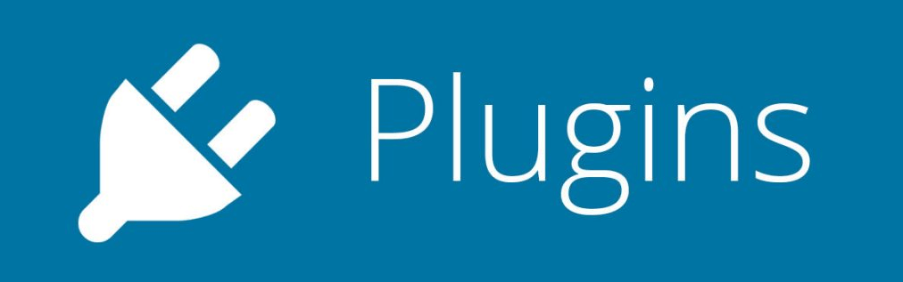

# 设计模式之Plug-In模式


早两年所在公司有一个需求：针对视频播放做一些视频的播放事件上报，比如
- 视频自然缓冲上报（由于网络造成的自然卡顿），一旦进入缓冲状态则上报一次事件
- 视频拖拽缓冲上报
- 心跳上报，在播放开始后的第15秒、第45秒、第60秒分别上报一次，然后稳定在每2分钟上报一次。当播放器暂停时，停止计时与上报，继续播放后接着计时与上报
- 用户主动拖拽进度条操作上报

从这个需求里，我们可以引申出一些关于设计的话题：
> 该如何设计代码以应对这种需求，以及未雨绸缪地应对产品下次类似需求？

刚从学校毕业一两年的童鞋，最可能的做法应该是在播放页直接取video的dom对象去监听以上这一系列事件吧？很可惜的是，这些事件video并未直接提供给我们，而是需要我们设置一些变量去统计。

> 拿缓冲事件作比，video本身有一个`timeupdate`事件，只要视频处于播放状态，就会一直源源不断的触发这个事件。我们可以在每一次触发时记录一个当前时间戳，下次触发时比较这个时间戳看是否超过`1s`（超过1s就是在缓冲）。此外，我们还要区别是自然播放造成的缓冲事件还是手动拖拽造成的缓冲事件，所以需要结合拖拽事件一起分析并区分。

所以，这些较为复杂的事件监听代码会**强耦合**到我们的业务代码里。

毕业两三年的童鞋，应该会意识到这个问题，并将这一系列操作抽取出去形成一个独立的模块或类。

比如：

```javascript
EventReport.registe(videoDom);
```

然后将这些监听点的代码放到EeventReport模块里，又或者更步一步的再抽几个模块用于分离。从我这些年见过不同公司的业务代码里，基本上后者居多。

针对于完成需求，做到这些够了吗？

的确是够了，哪怕产品再提一些相关需求，只要改改这些模块，反正不会影响业务代码。

但这不是本文需要拎出来说的重点，我要提的是**设计模式**。

## [Plug-In模式](https://en.wikipedia.org/wiki/Plug-in_%28computing%29)
插件模式是一个应用很普遍的软件架构模式。经典例子如 Eclipse、jQuery、VS Code 等插件机制。

插件通常是对一个应用（host application，宿主应用）整体而言，通过插件的扩展为一个应用添加新的功能或 features。一个插件相当于一个 component，插件内部可以包含许多紧密相关的对象。

为什么要提到这个模式？因为我认为上面的这一系列需求（以及产品脑洞大开的后续相关需求），都属于可以脱离业务代码存在的独立个体！

- 首先，提供支持插件的"微内核"可以单独发布成第三方库，只要是针对videoDom元素都可以监听（以下简称`微内核`）
- 其次，不同的事件有不同的上报插件，针对产品的需求可以增加插件的类目
- 最后，微内核可以随时卸载，插件也可以随时卸载。

其实是一个非常简单的微内核实现，没有生命周期控制（只能注册与卸载），代码不过百来行，但是它能将代码理得非常顺畅，简洁易读易维护。

贴出微内核代码如下：
```javascript
  var __EVENTS = ['play','timeupdate','ended','error','loadstart','loadedmetadata','playing','pause','seeking','seeked','waiting'];

  var VideoMonitor = function() {
    throw new TypeError('请使用monitor方法进行监测');
  };

  var seekingStart = 0;

  window.onerror = function(msg){
    H._debug.error(msg);
  }

  VideoMonitor.prototype = {
    constructor: VideoMonitor,
    init:function(videoDom, videoInfo){
      this.videoDom = videoDom;
      this.videoInfo = videoInfo;
      this.lastTimeupdate = 0;
      this.seekTime = -1;
      this.suuid = STK.$.getsUUID();
      this.firstBuffer = true;
      this.seekTimeout = null;
      this.bindContext();
      this.bindEvents();
    },
    destroy:function(){
      this.unbindEvents();
      setTimeout(()=>{
        this.videoDom = null;
        this.videoInfo = null;
      });
    },
    bind:function(fn, ctx) {
      return function (a) {
        var l = arguments.length;
        return l ? l > 1 ? fn.apply(ctx, arguments) : fn.call(ctx, a) : fn.call(ctx);
      };
    },
    bindContext:function(){
      this.onEventHandler = this.bind(this.onEventHandler,this);
    },
    bindEvents:function(){
      let playerDom = this.videoDom;
      for(var event in __EVENTS){
        playerDom.addEventListener(__EVENTS[event], this.onEventHandler, false);
      }
    },
    unbindEvents:function(){
      let playerDom = this.videoDom;
      for(var event in __EVENTS){
        playerDom.removeEventListener(__EVENTS[event], this.onEventHandler, false);
      }
    },
    onEventHandler:function(e){
      //触发自身回调事件
      if(this[e.type] && typeof this[e.type] === 'function'){
        this[e.type].call(this,e);
      }
      //触发外部注册的句柄回调
      this.fireHandler(e);
    },
    fireHandler:function(e,data){
      for(var i = 0,len = handlerArray.length;i<len;i++){
        if(handlerArray[i][e.type] && typeof handlerArray[i][e.type] === 'function'){
          handlerArray[i][e.type](e,$.extend(this.videoInfo,data,{suuid:this.suuid}));
        }
      }
    },
    play:function(e){
      this.lastTimeupdate = +new Date();
      this.startHeartBeatCount();
    },
    playing(){
      this.lastTimeupdate = +new Date();
    },
    pause:function(){
      this.lastTimeupdate = +new Date();
      this.stopHeartBeatCount();
    },
    seeking(e){
      this.lastTimeupdate = +new Date();
      if (seekingStart == 0) {
        seekingStart = this.lastTimeupdate;
      }
      if (this.seekTime == -1 && e.target.currentTime != 0) {
        this.seekTime = e.target.currentTime;
      }
    },
    seeked(e){
      var self = this;
      var player = e.target;
      var td = 0;
      if (seekingStart > 0) {
        td = new Date().getTime() - seekingStart;
      }
      // 拖拽结束后上报drag时间
      this.lastTimeupdate = +new Date();
      if (player.currentTime != 0 && player.currentTime != this.videoInfo.info.duration && seekingStart > 0) {
        if (this.seekTimeout) {
            clearTimeout(this.seekTimeout);
            this.seekTimeout = null;
        }
        this.seekTimeout = setTimeout(
          e => {
              self.fireHandler({type:'drag',target:self.videoDom});
              this.seekTime = -1;
              seekingStart = 0; // 只有上报了才置0
          }, 
          1000
        );
      }   
    },
    timeupdate(e){
      var self = this;
      // 获取两次timeupdate事件间隔，用于卡顿判断
      var now = +new Date();
      if (this.lastTimeupdate !== 0) {
        var d = now - this.lastTimeupdate;
        // 时间间隔超过1s,认为是在缓冲中
        if (d >= 1000) {
          self.fireHandler({type:'buffer',target:self.videoDom},{firstBuffer:self.firstBuffer});
          self.firstBuffer = false;//第一次缓冲已经发生过了
        }
      }
      this.lastTimeupdate = now;
    },

    //收集观看时长并每秒通知一次
    currentCount:0,
    timer:null,
    startHeartBeatCount:function(){
      var self = this;
      self.timer = setTimeout(function(){
        self.currentCount++;
        self.fireHandler({type:'count',target:self.videoDom},{count:self.currentCount});
        self.startHeartBeatCount();
      },1000);
    },
    stopHeartBeatCount:function(){
      clearTimeout(this.timer);
      this.timer = null;
    }
  };

  VideoMonitor.prototype.init.prototype = VideoMonitor.prototype;

  var MonitorArray = [], handlerArray = [];

  VideoMonitor.monitor = function(videoDom, videoInfo ) {
    var monitor = new VideoMonitor.prototype.init(videoDom,videoInfo);
    MonitorArray.push({
      dom:videoDom,
      instance:monitor
    });
    return monitor;
  };

  VideoMonitor.listen = function(handler) {
    handlerArray.push(handler);
  };

  VideoMonitor.destroy = function(videoDom) {
    var monitor = findInstance(videoDom);
    removeInstance(videoDom);
    monitor && monitor.destroy();
  };

  function findInstance(videoDom){
    for(var index in MonitorArray){
      if(MonitorArray[index].dom === videoDom)
        return MonitorArray[index].instance;
    }
    return null;
  }

  function removeInstance(videoDom){
    for(var index in MonitorArray){
      if(MonitorArray[index].dom === videoDom)
        MonitorArray.splice(index,1);
    }
  }
```

总结一下以上微内核代码，总共有四方面内容：
- 通过`monitor` 监控videoDom元素并保存实例引用
- 通过`listen` 注册不同的上报插件
- 微内核会监听videoDom的所有事件并转发到插件里
- 微内核会分析videoDom的事件并整合出一些便于上报的合成事件，如
  - count  视频播放计时器，每秒通知一次，暂停或拖拽时会暂停计时，便于外部handler进行视频观看时长的上报；
  - buffer 自然缓冲通知，由于网络问题造成的自然卡顿结束
  - drag   用户拖拽通知，由于用户拖拽造成的卡顿结束

再贴一个心跳的上报插件代码
```javascript
  class HBStatHandler{
    ended(e,videoInfo){
      H._debug.log('HBStatHandler ended-----');
      var data = $.extend(base,{
        cf:videoInfo.info.clip_type,
        vts:videoInfo.info.duration,
        pay:videoInfo.info.paymark,
        ct:e.target.currentTime,
                suuid:videoInfo.suuid,
        idx:++idx,
        ht:2
      });
      stk.create(data,url);
    }

    count(e,videoInfo){
      var data = $.extend(base,{
        cf:videoInfo.info.clip_type,
        vts:videoInfo.info.duration,
        pay:videoInfo.info.paymark,
                suuid:videoInfo.suuid,
        ct:e.target.currentTime
      });
      //15秒上报
      if(videoInfo.count === 15){
        H._debug.log('HBStatHandler 15秒上报');
        data.idx = ++idx;
        data.ht = 3;
        stk.create(data,url);
        return;
      }
      //45秒上报
      if(videoInfo.count === 45){
        H._debug.log('HBStatHandler 45秒上报');
        data.idx = ++idx;
        data.ht = 4;
        stk.create(data,url);
        return;
      }
      //60秒上报
      if(videoInfo.count === 60){
        H._debug.log('HBStatHandler 60秒上报');
        data.idx = ++idx;
        data.ht = 5;
        stk.create(data,url);
        return;
      }
      //60秒后每2分钟上报一次
      if(((videoInfo.count-60)/60)%2==0){
        H._debug.log('HBStatHandler 每2分钟上报一次 videoInfo.count='+videoInfo.count);
        data.idx = ++idx;
        data.ht = 6;
        stk.create(data,url);
        return;
      }
    }
	}

```

微内核监听videoDom
```javascript
  VideoMonitor.monitor(videoDom); // 第二个参数为视频附加属性，上报时使用
```
微内核注册插件
```javascript
  VideoMonitor.listen(new BufferStatHandler());
```

插件模式的使用虽然代码量（注册、监听，派发）比强耦合稍多一些，但它简洁明了、清晰易懂、轻松插拨、随意扩展。

正所谓前人栽树，后人乘凉，相比起很多被后人骂***的代码，这段代码应该会减轻后人维护的难度了。
